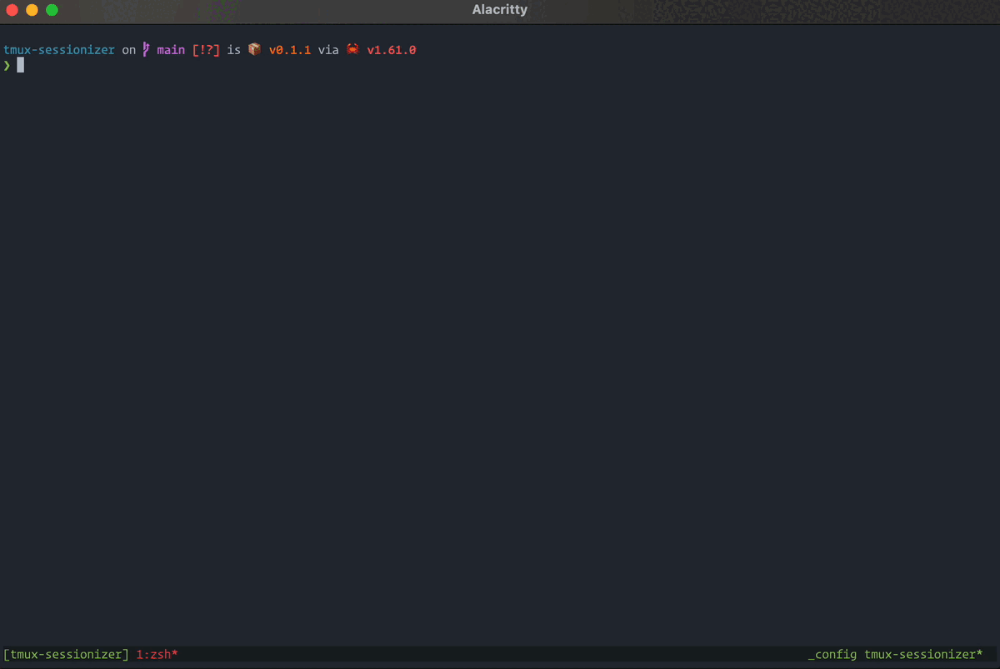
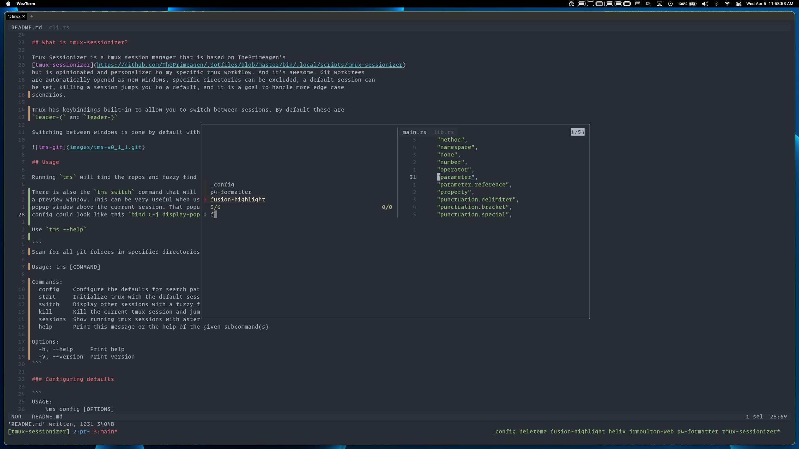
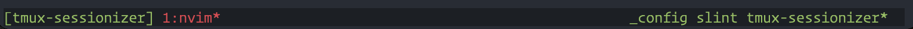

# tmux-sessionizer (tms)

The fastest way to manage projects as tmux sessions

## What is tmux-sessionizer?

Tmux Sessionizer is a tmux session manager that is based on ThePrimeagen's
[tmux-sessionizer](https://github.com/ThePrimeagen/.dotfiles/blob/master/bin/.local/scripts/tmux-sessionizer)
but is opinionated and personalized to my specific tmux workflow. And it's awesome. Git worktrees
are automatically opened as new windows, specific directories can be excluded, a default session can
be set, killing a session jumps you to a default, and it is a goal to handle more edge case
scenarios.

Tmux has keybindings built-in to allow you to switch between sessions. By default, these are
`leader-(` and `leader-)`

Switching between windows is done by default with `leader-p` and `leader-n`



## Usage

### The `tms` command

Running `tms` will find the repos and fuzzy find on them. It is very convenient to bind the tms
command to a tmux keybinding so that you don't have to leave your text editor to open a new project.
I have this tmux binding `bind C-o display-popup -E "tms"`. See the image below for what this look
like with the `tms switch` keybinding

### The `tms switch` command

There is also the `tms switch` command that will show other active sessions with a fuzzy finder and
a preview window. This can be very useful when used with the tmux `display-popup` which can open a
popup window above the current session. That popup window with a command can have a keybinding. The
config could look like this `bind C-j display-popup -E "tms switch"`. Then when using leader+C-j the
popup is displayed (and it's fast)



### The `tms windows` command

Similar to `tms switch`, you can show other active windows in the current session with a fuzzy
finder and a preview window. A config for use with `display-popup`, could look like this
`bind C-w display-popup -E "tms windows"`.

### The `tms rename` command

Using this command you can automatically rename the active session along with the directory name and
the active directory inside all the panes in the active session will be changed to the renamed
directory

`tms rename <new_session_name>`

`bind C-w command-prompt -p "Rename active session to: " "run-shell 'tms rename %1'"`.

### The `tms refresh` command

Using this command you can automatically generate missing worktree windows for the active session or
a provided `session_name`.

`tms refresh <session_name>`

`bind C-r "run-shell 'tms refresh'"`.

### The `tms kill` command

Using this command you can kill current tmux session and automatically jump to another. The config
could look like this `bind C-k confirm -p "Kill current session? (y/N):" "run-shell 'tms kill'"`.
Then when using leader+C-k you have to confirm killing of the current session with `y`. Any other
input or just pressing enter aborts it.

With `tms config --session <name>` you can define to which session you will switch to after the
kill.

### CLI overview

Use `tms --help`

```
Scan for all git folders in specified directories, select one and open it as a new tmux session

Usage: tms [COMMAND]

Commands:
  config        Configure the defaults for search paths and excluded directories
  start         Initialize tmux with the default sessions
  switch        Display other sessions with a fuzzy finder and a preview window
  windows       Display the current session's windows with a fuzzy finder and a preview window
  kill          Kill the current tmux session and jump to another
  sessions      Show running tmux sessions with asterisk on the current session
  rename        Rename the active session and the working directory
  refresh       Creates new worktree windows for the selected session
  clone-repo    Clone repository and create a new session for it
  init-repo     Initialize empty repository
  bookmark      Bookmark a directory so it is available to select along with the Git repositories
  open-session  Open a session
  marks         Manage list of sessions that can be instantly accessed by their index
  help          Print this message or the help of the given subcommand(s)

Options:
  -h, --help     Print help
  -V, --version  Print version
```

### Configuring defaults

```
Configure the defaults for search paths and excluded directories

Usage: tms config [OPTIONS]
       tms config <COMMAND>

Commands:
  list  List current config including all default values
  help  Print this message or the help of the given subcommand(s)

Options:
  -p, --paths <search paths>...
          The paths to search through. Shell like expansions such as '~' are supported
  -s, --session <default session>
          The default session to switch to (if available) when killing another session
      --excluded <excluded dirs>...
          As many directory names as desired to not be searched over
      --remove <remove dir>...
          As many directory names to be removed from exclusion list
      --full-path <true | false>
          Use the full path when displaying directories [possible values: true, false]
      --search-submodules <true | false>
          Also show initialized submodules [possible values: true, false]
      --recursive-submodules <true | false>
          Search submodules for submodules [possible values: true, false]
      --switch-filter-unknown <true | false>
          Only include sessions from search paths in the switcher [possible values: true, false]
  -d, --max-depths <max depth>...
          The maximum depth to traverse when searching for repositories in search paths, length should match the number of search paths if specified (defaults to 10)
      --picker-highlight-color <#rrggbb>
          Background color of the highlighted item in the picker
      --picker-highlight-text-color <#rrggbb>
          Text color of the highlighted item in the picker
      --picker-border-color <#rrggbb>
          Color of the borders between widgets in the picker
      --picker-info-color <#rrggbb>
          Color of the item count in the picker
      --picker-prompt-color <#rrggbb>
          Color of the prompt in the picker
      --session-sort-order <Alphabetical | LastAttached>
          Set the sort order of the sessions in the switch command [possible values: Alphabetical, LastAttached]
      --clone-repo-switch <Always | Never | Foreground>
          Whether to automatically switch to the new session after the `clone-repo` command finishes
          `Always` will always switch tmux to the new session
          `Never` will always create the new session in the background
          When set to `Foreground`, the new session will only be opened in the background if the active
          tmux session has changed since starting the clone process (for long clone processes on larger repos) [possible values: Always, Never, Foreground]
      --enable-list-worktrees <true | false>
          Enable listing of woktrees for bare repositories [possible values: true, false]
  -h, --help
          Print help
```

#### Config file location

By default, tms looks for a configuration in the platform-specific config directory:

```
Linux: /home/alice/.config/tms/config.toml
macOS: /Users/Alice/Library/Application Support/tms/config.toml
Windows: C:\Users\Alice\AppData\Roaming\tms\config.toml
```

If the config directory can't be found, it will also check `~/.config/tms/config.toml` (only
relevant on Windows and macOS). Alternatively, you can specify a custom config location by setting
the `TMS_CONFIG_FILE` environment variable in your shell profile with your desired config path.

#### Customizing keyboard shortcuts

Keyboard shortcuts can be customized by adding a `[shortcuts]` section in the config file and adding
bindings as pairs of `shortcut = action`, for example:

```
[shortcuts]
"ctrl-k" = "delete_to_line_end"
```

Available actions are:

- "" (to remove a default binding)
- "cancel"
- "confirm"
- "backspace"
- "delete"
- "move_up"
- "move_down"
- "cursor_left"
- "cursor_right"
- "delete_word"
- "delete_to_line_start"
- "delete_to_line_end"
- "move_to_line_start"
- "move_to_line_end"

## Installation

[](https://repology.org/project/tmux-sessionizer/versions)

### Pre-built binaries

Check the [releases page](https://github.com/jrmoulton/tmux-sessionizer/releases) for the latest
pre-built binaries

### Cargo

Install with `cargo install tmux-sessionizer` or

### From source

Clone the repository and install using `cargo install --path . --force`

## Usage Notes

The 'tms sessions' command can be used to get a styled output of the active sessions with an
asterisk on the current session. The configuration would look something like this

```
set -g status-right " #(tms sessions)"
```

E.g.  If this configuration is used it can be helpful
to rebind the default tmux keys for switching sessions so that the status bar is refreshed on every
session switch. This can be configured with settings like this.

```
bind -r '(' switch-client -p\; refresh-client -S
bind -r ')' switch-client -n\; refresh-client -S
```
 
## Shell completions

### Bash
```bash
echo "source <(COMPLETE=bash tms)" >> ~/.bashrc
```

### Zsh
```zsh
echo "source <(COMPLETE=zsh tms)" >> ~/.zshrc
```

### Fish
```fish
echo "COMPLETE=fish tms | source" >> ~/.config/fish/config.fish
```
